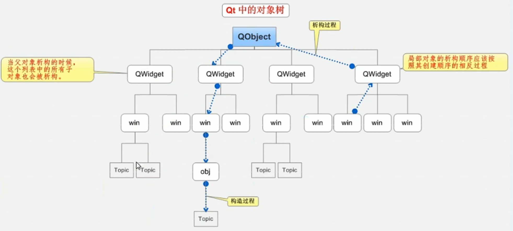

# C++ GUI Programming with QT5

## QWiget、QMainWindow、QDialog

QWidget是QMainWindow的基类，是一个空窗口
QMainWindow 比父类中多出了菜单栏、状态栏
QDialog 对话框

## 快捷键

运行        `ctrl + r`
编译        `ctrl + b`
整行移动    `ctrl + shift + ↑ 或 ↓`
帮助文档    `F1`
自动对齐    `ctrl + i`
.h .cpp切换 `F4`

## 按钮控件常用API

* 创建按钮 : `QPushButton *btn1 = new QPushButton`
* 设置parent : `setParent(this)`
* 设置文本 : `setText("text")`
* 移动位置 : `move(width, height)`
* 重新指定窗口/按钮大小 : `resize(width,height)`  /  `btn -> resize(width,height)`
* 设置窗口标题 : `setWindowTitle("title")`
* 设置窗口固定大小 : `setFixedSize(width, height)`

## 对象树

创建的对象在堆区时，如果指定的**parent**是**继承自QObejct类或者QObject派生的子类**，会**将对象放入对象树**中，构造从上到下，析构从下到上，因此可以不用管理释放的操作。

尽量给对象指定parent简化了内存回收机制



## 信号(signal)和槽(slot)

### 信号槽的优势

松散耦合--信号发送端和接收端没有关联，通过connect函数将发送端和接收端耦合在一起。

### Signals常用函数

* chlicked(bool) 点击
* pressed() 按下
* released() 释放
* toggled(bool) 切换状态

### 实现

连接函数：**connnect**
    参数1：信号的发送者
    参数2：发送的具体信号
    参数3：信号的接收者
    参数4：处理的槽函数
例：关闭窗口 connect(btn, &QPushButton::click, this, &QWidget::close)

断开连接：**disconnect**

### 自定义信号和槽

#### 自定义信号

    写到signals下
    返回值 void
    需要声明，**不需要实现**
    可以有参数，可以重载

#### 自定义槽函数

    写到public slot下，也可以写到public或者全局函数下
    返回值 void
    需要声明，**需要实现**
    可以有参数，可以重载

#### 触发自定义信号

    emit 自定义信号

#### 信号或者槽函数发生重载

    声明函数指针指向特定的函数地址，将函数指针作为connect的参数
    
    例：void(Teacher :: *tSignal)(QString) = &Teacher :: hungry();

#### 拓展

* 信号可以连接信号
* 一个信号可以连接多个槽函数，槽函数的执行顺序是一致的
* 多个信号可以连接一个槽函数
* 信号和槽函数的参数 类型一一对应
* 信号的参数个数 可以多于 槽函数的参数个数

注意：QString输出默认带引号，如果想不带引号，则调用.toUtf8().data()转换成char*类型。.toUtf8()转为QByteArray，.data()转为char\*

## Lambda表达式

### 函数声明

\[](){}: 匿名函数

* [=] 可以使用局部变量，按**值**进行传递
* [&] 可以使用局部变量，按**引用**进行传递
* [变量] 允许该变量进行值传递
* [&变量] 允许该变量进行引用传递
* [this] 允许使用Lambda表达式所在类中的所有成员变量
() 参数
{} 函数体

**最常用的：**`[=] () { }`

### mutable

用于修饰**值传递**的变量，修改的是**拷贝**，而不是本体
例：`[m]()mutable {m += 10;}`,可以改变m的值

### 返回值

`[]() -> int{}`
例：`int ret = []() -> int{return 100;};`

### 槽函数

```cpp

//如果第4个参数是lambda表达式，则第3个参数可以省略掉
connect(btn, &QPushButton::clicked, this, [=](){
    this -> close();
});

```

## MainWindow

### 菜单栏QMenuBar

只能有一个

```cpp

//创建菜单
QMenuBar * bar = menuBar();
setMenuBar(bar);
//创建菜单栏
QAction * newAction =  fileMenu->addAction("新建");
//添加分隔符
fileMenu->addSeparator();

```

### 工具栏QToolBar

可以有多个
```cpp
//创建工具栏
QToolBar * toolBar = new QToolBar(this);
addToolBar(toolBar);
//设置停靠范围只能是上下
toolBar->setAllowedAreas(Qt::LeftToolBarArea | Qt::RightToolBarArea);
//取消浮动
toolBar->setFloatable(false);
//禁止移动
toolBar->setMovable(false);
//给工具栏设置栏目
toolBar->addAction("绝了"或者QAction);
//给工具栏添加控件
toolBar->addWidget(QPushButton按钮);
```

### 状态栏QStatusBar

只能有一个
```cpp
QStatusBar * stBar = statusBar();
setStatusBar(stBar);
//添加标签控件
QLabel * label = new QLabel("左侧提示的信息",this);
QLabel * label1 = new QLabel("右侧提示的信息",this);
stBar->addWidget(label);
stBar->addPermanentWidget(label1);
```

### 铆接部件QDockWidget

可以有多个
```cpp
QDockWidget * dockWidget = new QDockWidget("浮动",this);
//放置位置下面 如果没有中心部件默认占满
addDockWidget(Qt::BottomDockWidgetArea,dockWidget);
//设置只允许上下
dockWidget->setAllowedAreas(Qt::TopDockWidgetArea | Qt::BottomDockWidgetArea);
```

### 中心部件

只能有一个
```cpp
//文本窗口 QTextEdit
QTextEdit * edit = new QTextEdit(this);
//设置中心部件
setCentralWidget(edit);
```

### 小结

只能有一个 set
可以有多个 add

## 资源文件添加

1. 将图片文件文件夹拷贝到项目下
2. 右键项目->添加新文件->Qt->Qt recourse File
3. res 生成 res.qrc
4. 右键res.qrc->open in editor 编辑资源
5. 添加前缀 添加文件
6. 使用 ": + 前缀名 + 文件名"

## 事件

### 鼠标事件

```cpp
    //鼠标进入事件
    virtual void enterEvent(QEvent *event);
    //鼠标离开事件
    virtual void leaveEvent(QEvent *event);
    //鼠标按下
    virtual void mouseReleaseEvent(QMouseEvent *ev);
    //鼠标释放
    virtual void mousePressEvent(QMouseEvent *ev);
    //鼠标移动,如果要识别是哪个鼠标移动，则需要使用ev -> buttons() & Qt::LeftButton,追踪鼠标状态也可以使用setMouseTracking(true)
    virtual void mouseMoveEvent(QMouseEvent *ev);

        ev->x(),ev->y() -- 打印坐标信息
        ev->button() -- 判断左右键 Qt::LeftButton 和 Qt::RightButton
        ev->buttons() -- 判断组合按键，按键的同时move 结合&操作符
```

### 定时器事件

```cpp
//通过事件启动定时器
    //启动定时器事件
    startTimer(1000); //启动定时器，单位毫秒，返回一个唯一定时器id，每1000毫秒启动一次定时器，即每1000毫秒调用一次timerEvent()函数
    
    //定时器事件,可以通过ev->timerId()== id1来判断当前是哪个id进来的
    void timerEvent(QTimerEvent * ev); 

//通过定时器类QTimer
    QTimer * timer = new QTimer(this);
    //启动定时器 每隔500秒发一个信号
    timer->start(500);
    //连接信号
    connect(timer,&QTimer::timeout,[=](){
        static int num = 1;
        ui->label_5->setText(QString::number(num++));
    });
    //暂停
    timer -> stop();
```

### 事件分发器

```cpp
    //返回值是bool类型，如果返回true，代表用户要处理这个事件,不向下分发事件了[类似于钩子]
    bool event(QEvent * ev)
    //事件枚举QEvent
    ev.type();//返回事件类型
    //拦截后，比如与 ev.type() 相匹配
    QMouseEvent *ev = static_cast<QMouseEvent *>('QEvent中的形参');
```

### 事件过滤器


在程序事件分发到事件分发器前，可以利用过滤器做拦截

1. 给控件安装事件过滤器 `ui->label->installEventFilter(this)`--表示`this`给`ui->label`安装过滤器。
2. 重写`eventFilter(QObject obj, QEvent e)`函数 -- `obj`将传入安装过滤器的目标对象，例如上面的`ui->label`，`e`将传入目标事件，例如`QEvent::MouseButtonPress`。
3. `return true`表示用户自己处理事件，不向下分发。其他交给父类的默认`enventFilter`，即`return QWidget::eventFilter(obj, e);`，如果父类是`QWidget`。
